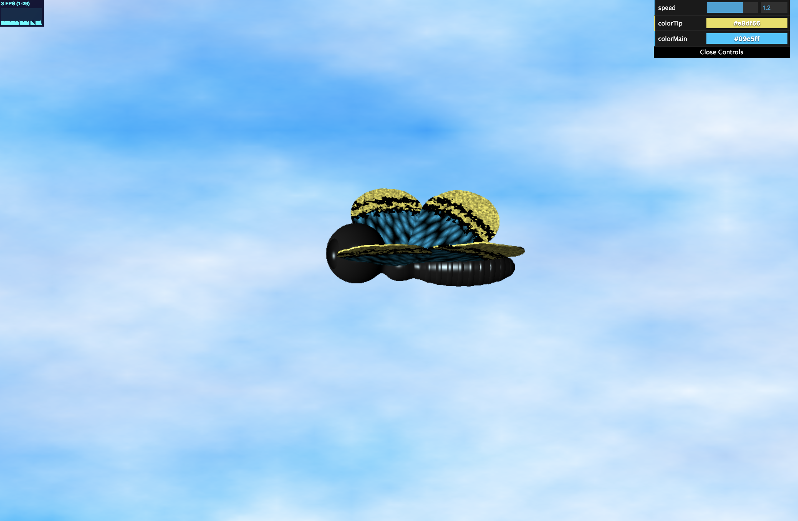
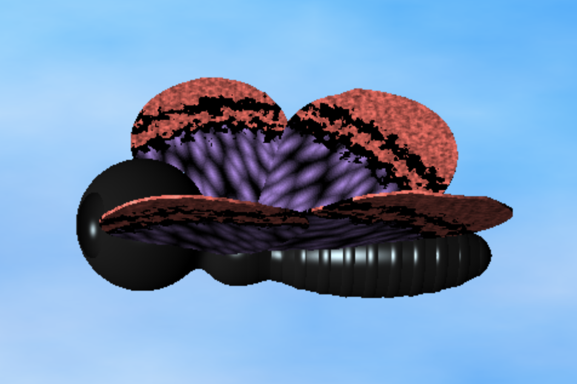
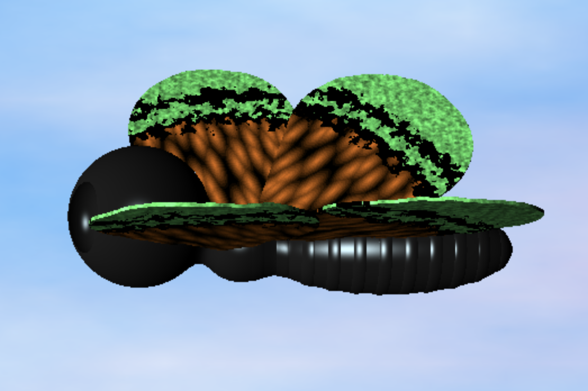

# Grace Gilbert (gracegi)

## Demo Link
<https://gracelgilbert.github.io/hw02-raymarching-sdfs/>

## External Resources
- For the SDF functions, both the shape equations and the combination of SDF functions, I used functions from Inigo Quilez's blog:
<https://www.iquilezles.org/www/articles/distfunctions/distfunctions.htm>
- For normal calculation of SDFs, I referenced the following source:
<http://jamie-wong.com/2016/07/15/ray-marching-signed-distance-functions/>
- I also referenced the CIS 460 lecture material on ray marching.

## Inspiration
Over the summer, I used Houdini to generate procedural butterfly patterns which I used to shade butterflies. That project utilized existing software packages that have extensive features available. I was curious to see what I could create purely procedurally using SDFs and other tools.

## Implementation
### Geometry
#### Body
The body of the butterfly is generally made up of three modified SDF spheres. These three sections are smoothly blended together using smooth union with a k value of 0.6, making the body look like it is one solid form.
- The center sphere is a simple SDF sphere of radius 1. 
- The tail of the butterfly is a sphere elongated in the x direction, accomplished by scaling the test point down in x to 0.3X the original. I then created a bumpy stripe pattern on the tail by offsetting the test point inward along the normal according to a sin curve. By offsetting the point inward, it inversely pushed the geometry outwards, forming raised stripes. I clamped the sin curve to be between 0.5 and 1.0, preventing the geometry from getting pushed in, and creating larger valleys than peaks in the curve. I also raised it to a power of 0.1 to smooth out the transition. 
- The head of the butterfly is an SDF sphere with two scaled spheres subtracted from it. These two spheres are elongated vertically, as well as elongated along x to carve deeper into the main sphere and create a more defined look. They are then translated to be on either side of the head.
#### Wings
The wings are created by intersecting a round cone and a thin box, both created with SDFs.
- The cones are rotated to be along the z axis, and then rotated about the y axis to be correctly angled against the butterfly. The top wings are rotated up by pi/13 degrees, and the bottom wings are rotated down by pi/3.65 degrees. The radii of the cone are scaled so that the side touching the butterfly comes to a sharp point, and the opposite end is wide and rounded with a rounding parameter value of 5.0.
- I then intersect the cone with a thin box. This box is large enough to cover the area of the cone, and has a width of 0.04. Intersecting the box with the cone, outputs a slice of the rounded cone shape, which looks like the shape of a wing.
### Normal Calculation
To calculate the normals of the surfaces, I split up the geometry into three pieces, the body, the top wing, and the bottom wing. I found the SDF value of each section an epsilon away in both directions, and used these slopes to calculate the normal. For this calculation, I referenced the source mentioned above. While I could have simply performed the normal calculation on the entire scene SDF function rather than in pieces, I liked being able to compute the normals and therefore colors in the scene SDF function itself, and then simply pass all the necessary information to main and output them. 
### Optimization Method
To optimize the ray marching in the scene, I implemented a BVH structure so that geometry that was not going to be hit by the current ray would not be accounted for. The root of the hierarchy is the entire scene. Since the butterfly is a fairly small portion of the screen, I created a bounding sphere around it and tested for intersection. If the ray will never hit that sphere, I don't march along it. If it does, I move the ray along to that intersection point. The next level determines if the ray will hit the upper wings, the lower wings, and/or the body. I test this using bounding spheres around these portions of the butterfly. If the ray will never hit geometry, I set the distance to that geomtry to be much larger than any distance in the scene, essentially ignoring that geometry. This ensures that in the union of the three main pieces, the ones that can be hit will be returned as the nearest distance rather than any geometry that will never be hit. If all pieces will never be hit, the returned distance will be very large. In the ray marching step that puts and upper bound on how far the ray can be marched, it will find that the ray has travelled too far and return no intersection. The final layer of the BVH structure uses the same method to test if within the top wing section, if the ray hits the left wing or the right wing, and similarly for the bottom wings. I decided not to continue the BVH structure to finer details in the body because the geometry was very simple and it seemed as if the logic of the BVH structure might be slower than the calculations themselves.

One thing I could improve in my optimization method is to use a boudning box instead of a bounding sphere. The butterfly itself, especially its wings, are very flat. To encompass the entire shape into a bounding sphere, the sphere had to be fairly large, but the butterfly was not tall enough to fill it, so there was a lot of blank space within the boudning sphere. A ray may intersect the top or bottom of the sphere, but not be near the butterfly. A bounding box could get flatter and more tightly bound the butterfly shape.
### Materials
I created three textures for the butterfly, one for the body, one for the wings, and one for the sky. To determine which color to output, the scene SDF function outputs a color value depending on what geometry it hits. If it does not hit any geometry, then the sky color is output. To ensure that the textures do not appear to be moving as the butterfly moves, I transformed the position vectors used to calculate the material values by the same transformations I used to animate the butterfly, thereby ensuring that the textures animate with the butterfly so they do not look as if they are sliding along its surface.
- The body texture uses the normals of the form to create lambertian shading. On top of that, there the material is shiny. To do this, I took the dot product of the ray direction and the normal and used this to scale the base lambertian shading color. The closer the two directions are to being parallel, the bright the color. I raised the brightness scale to a larger power to sharpen the highlights so that they did not spread throughout the shape.
- The wings are made up of three sections. The main part is a stepped worley noise pattern. After calculating worley noise, I scaled it by a stepped function with 12 steps. This gave a cool looking effect. I rotated the worley cells to line up with the direction of the wing. To do this, instead of inputting the actual coordinates of the wing into the worley noise computation, I rotated the points, in effect rotating the pattern. The pattern on the outer edges of the wings is a 3D fbm noise pattern at a small scale. I chose to use a 3D fbm so that the little edge of the wing would not have stretching from a 2D texture. I applied this second texture at every point past a distance of 6.0 from the origin. To merge between these two textures, I added two concentric black stripes between a distance 6.0 and 7.5 away from the origin. To soften the edges of these stripes, I offset the x and z positions used to calculate the distance from the center by an fbm noise function, creating a rougher edge that bleeds into the next texture. The colors of the two sections of the wings are modifiable by the user using two color pickers. Variations of the colors can be seen below:

- The sky texture is a layering of two fbm functions that map out two slightly different shades and shapes of clouds on top of a blue backdrop. One fbm function is very elongated in the x direction, creating longer, thin clouds. These have a pink hue. I scaled down the contribution of these to make them somewhat subtle. Layered on top of these clouds are larger, less elongated white clouds. These clouds look puffier and fuller and are more prominent. 
### Animation
#### Wings
#### Body
#### Sky
